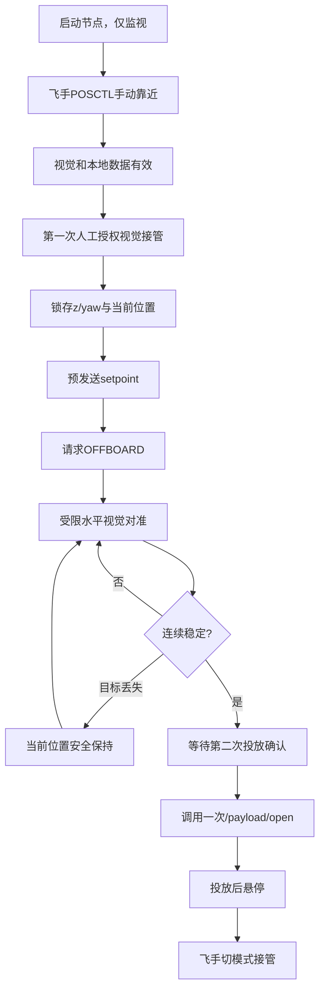
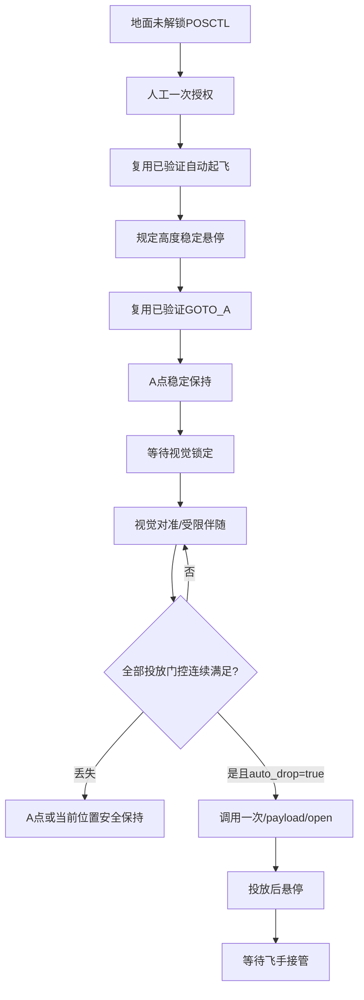

# 2026 D：半自动视觉瞄准与任务一全自动投放控制提示词

> 文档顺序：**第 0 节是可以直接复制给 Orin NX 机载电脑 Codex 的完整提示词，开头先明确最终应得到的运行效果；第 1 节以后是接口、状态机、安全边界、代码架构和验收细则。**
>
> 当前台式机仓库中的 `CUADC的瞄准脚本（参考用）/cuadc_control` 只看到了起飞、前飞、返航类脚本，尚未看到文件名或正文明确标注“半自动投放测试”“全自动投放测试”的脚本。因此，机载 Codex 开工前必须在 NX 的实际仓库中重新定位参考文件。若真正的 CUADC 瞄准/投放脚本尚未同步到 NX，只允许先完成接口适配层、状态机骨架、dry-run 和单元测试，**禁止凭空猜测 CUADC 话题、类名、按键和执行机构逻辑**。

## 0. 可直接复制给机载 Codex 的完整提示词

```text
你现在工作在 Orin NX 的 ROS1 Noetic 工作空间：
/home/password123456/catkin_ws

本次只修改已有控制功能包：
/home/password123456/catkin_ws/src/px4_basic_control

视觉功能包为：
/home/password123456/catkin_ws/src/d2026_vision

仓库中还会同步 CUADC 控制参考目录：
相对仓库根目录：CUADC的瞄准脚本（参考用）

====================
最终我要得到的代码运行效果
====================

完成后，px4_basic_control 中应新增两套彼此独立、不能同时运行的测试入口。

一、半自动视觉瞄准投放测试

运行类似：
roslaunch px4_basic_control semi_auto_visual_aim_drop.launch

最终效果：
1. 飞手先用遥控器在 POSCTL 中手动起飞，飞到地面或小车顶部靶标的大致上方，并保持安全高度；
2. 脚本启动后只监视 MAVROS、本地位姿、速度和 d2026_vision 视觉输出，不自动解锁、不自动起飞，也不立刻抢控制权；
3. 终端持续显示飞机状态、视觉状态、靶标相对飞机的米制误差、数据新鲜度、当前是否满足接管条件；
4. 操作者在真实交互终端输入明确授权短语或按 Enter 后，脚本锁存当前高度和 yaw，先连续预发送当前位置 setpoint，再申请进入 OFFBOARD；
5. 进入 OFFBOARD 后，脚本保持锁存高度和 yaw，只允许在水平面内以受限速度、小步进 setpoint 对准靶标；
6. 视觉有效时，优先使用 /d2026_vision/platform_point_local 给出的靶标 MAVROS local ENU 坐标，结合抛投机构相对机体中心的安装偏移，计算飞机应到达的水平位置；
7. 视觉未满足质量条件、消息过期、坐标系不明确或目标丢失时，不继续朝最后目标盲飞，立即在当前安全位置保持，并进入 WAIT_TARGET 或 TARGET_LOST_HOLD；
8. 飞机进入允许误差范围、水平和垂直速度足够小、视觉连续稳定达到设定时间后，进入 ALIGNED_WAIT_CONFIRM；
9. 半自动模式默认不得仅凭“已经对准”自动投放。终端必须再次要求操作者输入独立投放确认短语；
10. 确认后只调用一次已独立验证的 /payload/open 服务，检查 Trigger 返回值并锁存 payload_released=true，任何回调、重连或视觉抖动都不得造成第二次投放；
11. 投放后保持悬停，等待飞手把遥控器切回 POSCTL/ALTCTL 接管。第一版半自动脚本不自动返航、不自动降落；
12. 飞手在任何飞行阶段把模式切离 OFFBOARD，都视为人工接管。脚本立即停止更新任务目标，绝不再次请求 OFFBOARD。

二、任务一全自动投放测试

运行类似：
roslaunch px4_basic_control task1_auto_visual_aim_drop.launch

最终效果：
1. 不重写已经验证的“不同高度自动起飞”和“任务一起飞后自动前往 A 航点”逻辑；
2. Codex 必须先定位机载 px4_basic_control 中当前真正通过实飞验证的起飞脚本、A 航点脚本、参数文件和启动入口；
3. 新脚本由单一状态机、单一节点独占 /mavros/setpoint_position/local，复用或安全抽取现有已验证逻辑，禁止同时启动旧航点节点和新视觉节点去竞争同一个 setpoint 话题；
4. 操作者在地面、未解锁、POSCTL 状态下完成一次明确授权后，脚本按现有已验证流程自动起飞到配置高度，按任务要求稳定悬停，再自动前往 A 航点或现有任务一预锁定航点；
5. 到达 A 航点并稳定后进入视觉搜索/锁定阶段；
6. 识别到平台后，以受限水平 setpoint 跟随并对准平台，保持任务规定高度和锁存 yaw；
7. 只有视觉连续有效、允许的 detection_source、米制误差小、飞行速度小、消息时间戳新鲜、FCU connected、飞机仍为已解锁 OFFBOARD、执行机构节点就绪、尚未投放、任务未超时等条件全部连续满足后，才允许自动调用一次 /payload/open；
8. 第一版全自动投放测试在投放后保持当前位置悬停，发布 COMPLETE_WAIT_PILOT，并等待遥控器接管；不得擅自拼接尚未重新验证的自动返航或自动降落；
9. 后续只有在投放测试单独稳定后，才允许通过默认关闭的参数接回已经验证的返航/降落阶段；
10. 任意关键输入失效时进入安全保持或等待人工接管，不得沿最后视觉速度或最后目标持续追车。

====================
开始修改前必须先做的审计
====================

先执行并记录真实输出：
1. pwd
2. git rev-parse --show-toplevel
3. git status --short
4. rosversion -d
5. echo $ROS_DISTRO
6. python3 --version
7. rospack find px4_basic_control
8. rospack find d2026_vision
9. find /home/password123456/catkin_ws/src/px4_basic_control -maxdepth 3 -type f | sort
10. find /home/password123456/catkin_ws/src/d2026_vision -maxdepth 3 -type f | sort
11. REPO_ROOT=$(git rev-parse --show-toplevel); find "$REPO_ROOT/CUADC的瞄准脚本（参考用）" -type f | sort
12. rostopic list | sort
13. rosservice list | sort
14. rostopic info /mavros/setpoint_position/local
15. rosservice info /payload/open

必须查明并在开发报告中写清：
- 当前已实飞验证的不同高度起飞脚本、launch、YAML 和运行命令；
- 当前已实飞验证的“任务一自动前往 A 航点”脚本、状态机和参数；
- 哪个节点发布 /mavros/setpoint_position/local；
- d2026_vision 实际存在的话题、消息类型、frame_id、时间戳和频率；
- /payload/open 是否已经存在、服务类型是否为 std_srvs/Trigger、返回值含义；
- CUADC 目录中真正的半自动/全自动瞄准投放参考脚本路径。

如果 NX 上仍没有真正的 CUADC 半自动和全自动投放参考脚本：
- 在报告中明确写“参考脚本未同步”；
- 不得编造它的类名、函数、话题、按键和控制逻辑；
- 可以完成通用状态机、接口适配器、dry-run、mock 测试和文档；
- 等参考脚本同步后再做逐段对照复用。

如果找到了真正参考脚本，优先复用它的：
- 半自动/全自动模式分离方式；
- 操作者授权和二次确认方式；
- 视觉有效性门控；
- 对准保持计时；
- 投放只触发一次的锁存；
- 状态打印、异常处理、退出流程和日志组织。

不得照搬 CUADC 中与本机不一致的部分：
- ArduPilot GUIDED/LOITER/RTL 模式；
- GPS、WGS84、global setpoint；
- CUADC 的桶、弹药、YOLO、自定义消息；
- 自动启动 roscore/MAVROS；
- 未经核验的相机坐标、NED/ENU 公式；
- 未经核验的投放舵机通道和 PWM。

====================
视觉接口约束
====================

控制包只消费 d2026_vision 输出，不得在 px4_basic_control 中重新写 AprilTag、圆环或十字识别。

预期接口如下，但必须以 NX 实际 rostopic type/echo 为准，并把话题名做成 ROS 参数：
- /d2026_vision/platform_visible，std_msgs/Bool；
- /d2026_vision/platform_center_px，geometry_msgs/Vector3Stamped，x=error_u，y=error_v，z=confidence，只作诊断和门控；
- /d2026_vision/platform_point_local，geometry_msgs/PointStamped，靶标在 MAVROS local ENU 中的绝对位置，作为水平控制首选；
- /d2026_vision/platform_point_body，geometry_msgs/PointStamped，靶标相对机体 FRD，只用于交叉检查和诊断；
- /d2026_vision/detection_source，std_msgs/String，期望 FUSED、GEOMETRY_ONLY、TAG_ONLY、CONFLICT、LOST、INVALID；
- /mavros/local_position/pose，geometry_msgs/PoseStamped；
- /mavros/local_position/velocity_local，geometry_msgs/TwistStamped；
- /mavros/state，mavros_msgs/State。

重要：
1. 不允许仅根据像素误差直接发送米制飞机移动；
2. 不允许把 camera optical 或 body FRD 的 x/y 直接当作 local ENU 的 x/y；
3. platform_point_local 的 frame_id、定义和数值必须通过静态抬靶/移动靶实验确认后才能用于闭环；
4. 如果 platform_point_local 尚未实现或没有通过坐标验证，只能运行 dry_run 和数据显示，禁止闭环飞行；
5. d2026_vision 已经消除相机安装外参时，控制脚本不得再次扣除相机前移量；
6. 控制脚本只补偿“抛投机构释放点相对机体中心”的独立安装偏移，禁止把相机偏移和抛投机构偏移混为一谈；
7. 所有 Header 时间戳和本机接收时间都要检查，旧数据不得用于控制；
8. CONFLICT、LOST、INVALID 默认禁止控制和投放；TAG_ONLY、GEOMETRY_ONLY 是否允许投放必须由 YAML 明确配置，不能硬编码。

====================
水平瞄准和投放点计算
====================

使用 ROS local ENU：x=East，y=North，z=Up。
机体系采用 FRD：x=Forward，y=Right，z=Down。

若视觉输出平台中心绝对位置：
p_target_local = [target_e, target_n]

抛投机构释放点相对机体中心的水平安装偏移用机体系参数表示：
p_release_body = [release_forward_m, release_right_m]

根据当前锁存 yaw，把释放点偏移旋转到 local ENU：
p_release_offset_local = R_body_to_local(yaw) * p_release_body

无提前量时飞机机体中心目标：
p_uav_desired = p_target_local - p_release_offset_local

若后续经过实测启用小车运动提前量：
p_drop_aim_local = p_target_local + v_target_filtered * lead_time
p_uav_desired = p_drop_aim_local - p_release_offset_local

第一版要求：
- lead_compensation_enabled 默认 false；
- 只预留低通滤波、最大目标速度、最大提前量和 servo_delay 参数；
- 未做真实运动投放标定前不得默认启用；
- 目标速度估计异常、跳变或数据不足时自动退回无提前量或禁止自动投放；
- 所有公式、符号、坐标系和实际参数必须写进 README。

目标 setpoint 不能瞬间跳到平台中心。每个控制周期只允许按 max_horizontal_setpoint_speed 和 max_setpoint_step_m 向期望点推进，并设置最大视觉修正半径 max_visual_correction_radius_m。超出半径说明飞手/航点没有把飞机带到足够接近的位置，脚本应保持或退出，不能大范围追逐。

====================
半自动状态机
====================

至少实现：
WAIT_SYSTEM
MANUAL_APPROACH
WAIT_ENABLE_CONFIRM
CAPTURE_HOLD_REFERENCE
PRESTREAM
REQUEST_OFFBOARD
WAIT_TARGET
VISUAL_ALIGN
ALIGNED_WAIT_CONFIRM
DROP_ONCE
POST_DROP_HOLD
TARGET_LOST_HOLD
PILOT_TAKEOVER
ABORT
COMPLETE

关键规则：
- 启动时允许飞机已经 armed，但必须 connected、POSCTL、本地位姿和速度新鲜；
- 脚本启动不等于接管；
- 第一次授权只允许视觉接管；
- 第二次授权才允许投放；
- 视觉对准期间固定高度和 yaw；
- 不控制下降；
- 对准计时必须连续，任何阈值失效立即清零；
- 投放后不得自动关闭再打开；
- 飞手切离 OFFBOARD 后不再请求 OFFBOARD；
- Ctrl+C 不能被描述成可靠的空中急停，必须提示用遥控器接管。

====================
任务一全自动状态机
====================

必须以机载现有已验证任务一脚本为准，建议至少包含：
WAIT_SYSTEM
WAIT_GROUND_AUTH
CAPTURE_HOME
PRESTREAM
REQUEST_OFFBOARD
REQUEST_ARM
TAKEOFF
TAKEOFF_HOLD
GOTO_A
HOLD_A
SEARCH_TARGET
VISUAL_LOCK
VISUAL_ALIGN_FOLLOW
DROP_GATE
DROP_ONCE
POST_DROP_HOLD
COMPLETE_WAIT_PILOT
PILOT_TAKEOVER
SAFE_HOLD
ABORT_GROUND

要求：
- 起飞高度、悬停时间、A 航点坐标和到达判据必须复用现有实飞版本的参数与算法；
- 不要复制出第二套未经验证的起飞实现；
- 若必须抽取公共类，先保留旧入口并做回归测试，旧脚本运行效果不得改变；
- 整个任务只能有一个 setpoint owner；
- 到 A 后视觉未找到目标时保持 A，不无限扩大搜索范围；
- 第一版不加入自动下降追靶；
- 第一版全自动投放完成后保持，不自动返航或降落；
- return_after_drop 和 land_after_drop 参数即使预留也必须默认 false，且未验证前不得实现隐藏自动路径。

====================
投放门控
====================

自动投放必须同时满足并连续保持 align_hold_seconds：
- payload_enabled=true；
- /payload/open 服务存在且类型正确；
- payload_released=false；
- MAVROS connected=true；
- armed=true；
- mode=OFFBOARD；
- local pose、local velocity、vision visible、platform point、detection source 全部新鲜；
- platform_visible=true；
- detection_source 位于 YAML 的 allowed_drop_sources；
- confidence >= min_drop_confidence；
- abs(error_local_x) <= drop_tolerance_x_m；
- abs(error_local_y) <= drop_tolerance_y_m；
- abs(vertical_error) <= drop_height_tolerance_m；
- horizontal_speed <= max_drop_horizontal_speed_mps；
- abs(vertical_speed) <= max_drop_vertical_speed_mps；
- 目标位置跳变和协方差未超限；
- 当前 setpoint 与飞机实测位置误差未超限；
- 任务未超时；
- 半自动模式收到第二次人工确认，或全自动模式明确配置 auto_drop_enabled=true。

调用 /payload/open 后：
- 记录调用时间、请求前全部门控值、Trigger success 和 message；
- 只调用一次；
- 服务失败时默认不自动无限重试；
- 是否允许一次人工重试必须由独立参数和新确认控制；
- payload_released 锁存值写入状态话题和日志；
- 不直接在本脚本中发送 MAV_CMD_DO_SET_SERVO，执行机构细节由独立 payload 节点负责。

====================
目标丢失和人工接管
====================

- 短时丢失小于 vision_short_loss_s：保持当前飞机位置，不再向旧目标推进；
- 超过 vision_abort_loss_s：进入 TARGET_LOST_HOLD/SAFE_HOLD，并禁止投放；
- 不得使用“最后一次目标速度”继续盲追；
- local pose 或 velocity 过期：禁止继续任务目标推进；
- MAVROS 断连：停止状态跃迁，维持能安全执行的 setpoint 发布策略并等待飞手接管；
- 飞手切换到 POSCTL/ALTCTL：立即进入 PILOT_TAKEOVER，永久停止本次任务的 OFFBOARD 请求；
- 任何异常不得在空中自动 disarm；
- 不修改 PX4、EKF、FAST-LIO2、MAVROS 或视觉参数来掩盖控制问题。

====================
代码架构
====================

不要把所有逻辑写进两个巨大脚本。优先在 px4_basic_control 内形成共享模块，建议结构如下；实际结构应结合机载现有包最小改动：

px4_basic_control/
├── README.md
├── scripts/
│   ├── semi_auto_visual_aim_drop.py
│   └── task1_auto_visual_aim_drop.py
├── src/px4_basic_control/
│   ├── vision_target_adapter.py
│   ├── visual_aim_controller.py
│   ├── drop_gate.py
│   ├── payload_client.py
│   ├── setpoint_safety.py
│   └── mission_common.py
├── config/
│   ├── semi_auto_visual_aim_drop.yaml
│   └── task1_auto_visual_aim_drop.yaml
├── launch/
│   ├── semi_auto_visual_aim_drop.launch
│   └── task1_auto_visual_aim_drop.launch
└── test/
    ├── test_visual_aim_math.py
    ├── test_drop_gate.py
    ├── test_target_timeout.py
    ├── test_one_shot_payload.py
    ├── test_pilot_takeover.py
    └── test_setpoint_slew_limit.py

共享模块职责：
- vision_target_adapter：订阅和校验 d2026_vision 输出，不控制飞机；
- visual_aim_controller：只做坐标和目标 setpoint 计算，不调用 ROS 服务；
- drop_gate：纯逻辑判断，返回允许/拒绝及原因列表；
- payload_client：只封装 /payload/open，一次性锁存；
- setpoint_safety：限速、限步长、限半径、时间戳和有限数检查；
- mission_common：复用现有 PX4 local 位姿、yaw、状态迁移和 setpoint 连续发布逻辑。

如果现有包没有 setup.py，不要盲目创建复杂打包结构；可采用 ROS Noetic 可正确 import 的最小方案，但必须模块化并通过 catkin 构建和实际 roslaunch 验证。

====================
参数要求
====================

所有危险值必须在 YAML 中显式配置，至少包括：
- dry_run，默认 true；
- control_enabled，默认 false；
- payload_enabled，默认 false；
- auto_drop_enabled，半自动固定 false，全自动默认 false；
- required_initial_mode；
- offboard_mode；
- setpoint_rate_hz，至少 20；
- prestream_duration_s；
- target_topic、visible_topic、center_px_topic、source_topic；
- vision_max_age_s；
- local_pose_max_age_s；
- local_velocity_max_age_s；
- allowed_control_sources；
- allowed_drop_sources；
- min_control_confidence；
- min_drop_confidence；
- max_visual_correction_radius_m；
- max_horizontal_setpoint_speed_mps；
- max_setpoint_step_m；
- aim_tolerance_x_m、aim_tolerance_y_m；
- drop_tolerance_x_m、drop_tolerance_y_m；
- align_hold_seconds；
- max_drop_horizontal_speed_mps；
- max_drop_vertical_speed_mps；
- release_forward_m、release_right_m；
- lead_compensation_enabled，默认 false；
- servo_delay_s；
- max_lead_m；
- vision_short_loss_s；
- vision_abort_loss_s；
- mission_timeout_s；
- return_after_drop=false；
- land_after_drop=false。

任何未实测参数都要标 TODO，不能用看似精确的虚构值冒充实测值。

====================
ROS 输出和日志
====================

至少发布：
- /uav/semi_auto_aim_drop/state 或 /uav/task1_auto_aim_drop/state，std_msgs/String；
- /uav/visual_aim/active_target，geometry_msgs/PoseStamped；
- /uav/visual_aim/error_local，geometry_msgs/Vector3Stamped；
- /uav/visual_aim/drop_gate，std_msgs/String，列出允许或拒绝原因；
- /uav/payload/released，std_msgs/Bool，latch=true。

终端以限频方式显示：
state、PX4 mode、armed、视觉 source/confidence/age、target local、aircraft local、error ENU、setpoint、速度、对准持续时间、drop gate、payload released。

两套入口都应自动保存 rosbag 到 flight_logs，至少记录：
/mavros/state
/mavros/local_position/pose
/mavros/local_position/velocity_local
/mavros/setpoint_position/local
/d2026_vision/platform_visible
/d2026_vision/platform_center_px
/d2026_vision/platform_point_local
/d2026_vision/platform_point_body
/d2026_vision/detection_source
/payload/state
以及本任务新增状态话题。

日志文件名区分 semi_auto 和 task1_auto，并带时间戳。没有实际录包成功时必须明确写未验证。

====================
分阶段实施，禁止一步上机
====================

G0：环境和参考脚本审计，只报告，不改飞控逻辑。
G1：完成 vision_target_adapter、坐标计算、drop_gate 和纯单元测试；dry_run=true，不发布 setpoint、不调用 payload。
G2：使用录包或 mock 话题运行半自动状态机，验证过期、跳变、LOST、CONFLICT 和 one-shot。
G3：实机拆投放物、先不接机械负载，验证 /payload/open 独立节点；不得与首次 OFFBOARD 试飞同一天直接合并跳级。
G4：有桨安全场地中只测试半自动视觉接管和水平对准，payload_enabled=false。
G5：半自动对准稳定后，在静止靶标上做人工二次确认投放。
G6：把现有任务一起飞和 A 航点逻辑接入新单状态机，先 dry_run 和无投放飞行。
G7：任务一自动到 A 后只视觉对准，payload_enabled=false。
G8：全部门控和日志通过后，才允许一次全自动投放测试。

每一级完成后都记录真实测试结果，失败不得写成通过。

====================
README 强制要求
====================

完成后必须更新：
/home/password123456/catkin_ws/src/px4_basic_control/README.md

没有更新 README，不得视为任务完成。README 至少写清：
1. 半自动和任务一全自动脚本的用途与能力边界；
2. 当前已实现、已实测、仅 mock 测试和未实现功能；
3. CUADC 参考脚本的实际路径、复用了哪些逻辑、哪些未复用；
4. 当前已验证起飞/A 航点代码的路径和复用方式；
5. d2026_vision 输入话题、类型、frame_id、时间戳和字段含义；
6. local ENU、body FRD、相机外参和抛投机构偏移的区别；
7. 飞机目标位置与释放点偏移的计算公式；
8. 两个状态机及每个状态含义；
9. 全部 YAML 参数和危险默认值；
10. 编译、source、启动、dry-run、mock、rosbag 和真机命令；
11. /payload/open 的前置条件和 one-shot 行为；
12. 遥控器接管方法；
13. 目标丢失、MAVROS 断连、视觉过期和服务失败时的行为；
14. 自动录包路径和复盘方法；
15. 实际测试结果、已知问题和下一步计划；
16. 明确说明第一版投放后默认保持悬停，不自动返航或降落。

====================
禁止事项
====================

- 禁止修改已经实飞验证的旧脚本行为而不保留兼容入口；
- 禁止同时运行两个 /mavros/setpoint_position/local 发布者；
- 禁止在控制包中重写视觉算法；
- 禁止直接使用像素误差控制米制位移；
- 禁止自动下降追踪靶标；
- 禁止单帧识别触发投放；
- 禁止目标丢失后继续盲飞；
- 禁止空中自动 disarm；
- 禁止默认启用 payload、auto_drop、运动提前量、返航或降落；
- 禁止假定舵机通道/PWM；
- 禁止伪造编译、测试、飞行或识别结果；
- 禁止覆盖用户当前未提交修改。

====================
最终交付报告
====================

按以下格式报告：
1. 实际工作路径与 ROS/PX4 环境；
2. 找到的 CUADC 半自动/全自动参考脚本路径；若未找到明确写未同步；
3. 找到的现有起飞和 A 航点实飞脚本路径；
4. 新增文件；
5. 修改文件；
6. README.md 新增章节；
7. 未修改的旧飞控、视觉和通信文件确认；
8. 实际输入话题、类型、frame_id 和频率；
9. 实际输出话题；
10. 两个状态机实现情况；
11. setpoint 单发布者检查结果；
12. Python 语法、单元测试和 catkin_make 真实结果；
13. dry-run、mock、rosbag、无投放飞行、半自动投放、全自动投放分别验证到哪一级；
14. /payload/open 实际返回结果；
15. 实测对准误差、稳定时间、视觉丢失行为和投放次数；
16. 自动录包路径；
17. 未实机验证内容；
18. 已知问题和下一步；
19. git status --short 与 git diff --check 结果。

现在先完成 G0 审计，再按 G1 到 G8 逐级推进。不要直接跳到带桨自动投放。
```

---

# 以下为代码功能细则与框架约束

## 1. 本阶段目标与非目标

### 1.1 本阶段目标

在已有 `px4_basic_control` 中新增两个控制入口：

1. **半自动瞄准投放测试**：飞手负责起飞和粗略靠近，程序只负责最后小范围视觉对准；投放必须二次人工确认。
2. **任务一全自动投放测试**：复用已验证的自动起飞和前往 A 航点流程，到达后由视觉完成最后瞄准，并在严格门控下自动投放一次。

### 1.2 本阶段明确不做

- 不在控制包内实现 AprilTag、圆环或十字检测；
- 不实现动态降落；
- 不实现视觉控制下降；
- 不默认实现投放后的返航和降落；
- 不直接控制 Pixhawk 舵机通道；
- 不修改 PX4、MAVROS、FAST-LIO2、桥接或 D435i 参数；
- 不把 CUADC 的 ArduPilot/GPS 控制照搬到 PX4 室内 SLAM 系统。

## 2. 三个功能包的职责边界

```text
d2026_vision
  负责：识别平台、融合 AprilTag/圆环十字、坐标变换、发布平台米制位置和状态
  不负责：发布 MAVROS setpoint、切模式、投放

px4_basic_control
  负责：状态机、OFFBOARD setpoint、视觉门控、目标丢失保护、调用 payload 服务
  不负责：图像识别、舵机 PWM 细节

payload 执行机构节点
  负责：/payload/open、通道/PWM校验、MAVROS CommandLong、动作结果
  不负责：决定何时允许投放
```

任何功能跨界都必须先解释原因，默认不得跨界。

## 3. 参考代码使用规则

### 3.1 CUADC 参考目录

```text
CUADC的瞄准脚本（参考用）/
```

机载 Codex 必须先列出实际文件并搜索：

```bash
REPO_ROOT=$(git rev-parse --show-toplevel)
find "$REPO_ROOT/CUADC的瞄准脚本（参考用）" -type f | sort
grep -RniE 'semi|auto|aim|drop|release|payload|target|投放|瞄准' \
  "$REPO_ROOT/CUADC的瞄准脚本（参考用）"
```

当前台式机副本只能确认其中有 `cuadc_control` 的起飞/前飞/返航脚本，不能确认真正投放参考脚本已经同步。因此文档不绑定虚构文件名。

### 3.2 允许复用

- 状态机组织；
- 人工授权和确认；
- 目标有效性连续计时；
- 半自动/全自动入口分离；
- 一次性投放锁存；
- 日志和异常分支。

### 3.3 禁止复用

- `GUIDED`、`LOITER`、ArduPilot `RTL`；
- WGS84 航点；
- CUADC 自定义视觉消息；
- 桶、弹药、任务投弹业务字段；
- 自动启动系统基础节点；
- 未经 NX 实测的通道、PWM 和坐标符号。

## 4. 视觉数据选择优先级

### 4.1 控制首选

```text
/d2026_vision/platform_point_local
```

它应表示平台中心在 MAVROS local ENU 中的绝对坐标。只有完成以下手工检查才允许闭环：

| 实验 | 期望 |
|---|---|
| 飞机静止，靶标向东移动 | target local x 按 ENU 定义变化 |
| 飞机静止，靶标向北移动 | target local y 按 ENU 定义变化 |
| 靶标静止，飞机小范围移动 | 平台绝对 local 坐标应基本稳定 |
| 飞机改变 yaw | 平台绝对 local 坐标不应随错误轴交换跳变 |
| 相机前移外参启用 | 控制包不得重复减相机偏移 |

### 4.2 诊断输入

- `platform_point_body`：检查目标位于机头前/后、左/右的符号；
- `platform_center_px`：显示像素误差和置信度，不直接生成米制 setpoint；
- `detection_source`：决定能否控制或投放；
- `platform_visible`：仅是必要条件，不是充分条件。

### 4.3 无效数据

以下任一情况都将视觉控制标为无效：

- 消息为空或包含 NaN/Inf；
- Header 时间戳为零且接口没有书面说明；
- 时间戳或接收时间超过阈值；
- frame_id 不符合配置；
- `platform_visible=false`；
- source 为 `CONFLICT/LOST/INVALID`；
- 目标单帧跳变超过限制；
- local point 与 body point 经转换后严重不一致。

## 5. 控制算法最小实现

### 5.1 控制量

第一版只控制：

```text
local ENU x
local ENU y
固定 local z
固定 yaw
```

上面的 `a local ENU y` 在代码中必须写成正常变量名，例如 `local_y`；这里强调四个控制量，不允许增加视觉下降。

### 5.2 期望位置

```text
飞机期望水平位置
= 平台预测投放点 local ENU
- 抛投释放点相对机体中心的 local ENU 偏移
```

相机安装偏移应由视觉包消除。控制包只处理释放机构偏移。

### 5.3 平滑限制

每周期执行：

```text
raw_desired -> 最大修正半径裁剪 -> 最大步长裁剪 -> 最大速度裁剪 -> 发布
```

禁止将新检测到的平台坐标直接作为下一帧 setpoint，避免识别抖动造成飞机跳动。

### 5.4 高度与 yaw

- 半自动：接管瞬间锁存当前 local z 和 yaw；
- 全自动：使用任务一已验证的巡航高度和 yaw 逻辑；
- 视觉阶段不得改变高度；
- 如果高度偏差超限，只保持或退出投放门控，不通过视觉脚本主动追高度。

## 6. 半自动脚本详细流程



额外约束：

- 在 `MANUAL_APPROACH` 期间不得发布 MAVROS setpoint；
- 输入第一次授权时必须再次检查 mode/armed/数据新鲜度；
- 第二次确认必须与第一次确认使用不同提示语；
- 等待投放确认期间，若对准条件失效，立刻退回 `VISUAL_ALIGN`，旧确认不得缓存；
- `payload_enabled=false` 时只能显示“对准完成但投放被禁用”。

## 7. 任务一全自动脚本详细流程



必须优先保留现有任务一实飞代码的：

- 起点锁存；
- OFFBOARD 预发送；
- 进入 OFFBOARD 和解锁流程；
- 不同高度参数；
- A 航点计算方式；
- setpoint 发布频率；
- 到达与稳定判据；
- 飞手切模式接管保护。

若现有任务一是一个独立 ROS 节点，不能通过同时 roslaunch 两个控制节点来“串联”。应选择：

1. 从已验证节点抽取共享类，由新状态机单节点调用；或
2. 在保持旧入口不变的前提下，为原节点增加经过测试的可复用任务模块。

任何方案都必须证明没有双 setpoint 发布者。

## 8. 投放门控数据结构

建议 `drop_gate.py` 使用纯 Python 数据类：

```text
DropGateInput
- now
- mavros_connected
- armed
- mode
- pose_age
- velocity_age
- vision_age
- visible
- source
- confidence
- error_x_m
- error_y_m
- height_error_m
- horizontal_speed_mps
- vertical_speed_mps
- target_jump_m
- setpoint_tracking_error_m
- payload_enabled
- payload_service_ready
- payload_released
- operator_confirmed
- auto_drop_enabled
- mission_timed_out

DropGateResult
- allowed
- reasons[]
- stable_since
- stable_duration
```

门控函数不得调用 ROS 服务，便于使用 mock 数据覆盖全部拒绝分支。

## 9. 建议默认安全参数

下表只作为保守初始上限，必须在 NX 和实机上确认；未确认项在 YAML 标记 TODO：

| 参数 | 建议初值 | 说明 |
|---|---:|---|
| `dry_run` | `true` | 默认不控制 |
| `control_enabled` | `false` | 需人工显式开启 |
| `payload_enabled` | `false` | 默认不投放 |
| `auto_drop_enabled` | `false` | 默认不自动投放 |
| `setpoint_rate_hz` | `20.0` | OFFBOARD 连续发布 |
| `vision_max_age_s` | `0.20` | 需结合真实频率调整 |
| `max_visual_correction_radius_m` | `0.50` | 只做末端小范围修正 |
| `max_horizontal_setpoint_speed_mps` | `0.20` | 初期低速测试 |
| `max_setpoint_step_m` | `0.02` | 每周期目标步进限制 |
| `aim_tolerance_x_m` | `0.10` | 初期对准阈值 |
| `aim_tolerance_y_m` | `0.10` | 初期对准阈值 |
| `drop_tolerance_x_m` | `0.06` | 需实测 |
| `drop_tolerance_y_m` | `0.06` | 需实测 |
| `align_hold_seconds` | `1.5` | 必须连续满足 |
| `max_drop_horizontal_speed_mps` | `0.10` | 需结合伴飞调整 |
| `max_drop_vertical_speed_mps` | `0.08` | 防止升降中投放 |
| `vision_short_loss_s` | `0.20` | 短时丢失保持 |
| `vision_abort_loss_s` | `0.50` | 超时退出跟踪 |
| `lead_compensation_enabled` | `false` | 实测前关闭 |
| `return_after_drop` | `false` | 第一版关闭 |
| `land_after_drop` | `false` | 第一版关闭 |

这些值不是比赛最终参数，README 必须区分“建议初值”和“实测值”。

## 10. Setpoint 单发布者检查

启动前至少检查：

```bash
rostopic info /mavros/setpoint_position/local
rosnode list
```

若已有以下任意控制器仍在发布，脚本应拒绝进入控制状态：

- 旧一键起飞节点；
- 旧航点任务节点；
- `px4ctrl`；
- 另一套半自动/全自动投放节点；
- 任意未知 setpoint 发布者。

更稳妥的做法是在启动包装脚本中检查 publisher 数量和已知节点名，但不能依赖一次字符串匹配就宣称绝对安全。最终仍要在终端打印实际 publisher 列表。

## 11. Payload 服务边界

本控制任务只允许调用：

```text
/payload/open  std_srvs/Trigger
```

独立执行机构节点的设计参考 [[ESP32通信系统开发提示词]]，其内部才负责：

```text
/mavros/cmd/command
MAV_CMD_DO_SET_SERVO
servo_instance
open_pwm
```

控制脚本不得知道或覆盖具体 PWM。调用前检查服务存在，调用后记录：

- ROS transport 是否成功；
- Trigger `success`；
- Trigger `message`；
- 调用前门控快照；
- 是否已经锁存 `payload_released`。

## 12. 测试矩阵

### 12.1 无桨/离线

- [ ] 坐标旋转单元测试；
- [ ] 释放点偏移符号测试；
- [ ] 限速和限步长测试；
- [ ] 所有 source 状态门控测试；
- [ ] 视觉过期测试；
- [ ] NaN/Inf 测试；
- [ ] 目标跳变测试；
- [ ] 对准计时清零测试；
- [ ] payload one-shot 测试；
- [ ] 服务失败不无限重试测试；
- [ ] 飞手切模式后不重新请求 OFFBOARD 测试。

### 12.2 半自动飞行

1. `dry_run=true`，只看误差；
2. `control_enabled=true`、`payload_enabled=false`，测试视觉接管；
3. 静止靶标中心偏移 10/20/30 cm，检查修正方向；
4. 人为遮挡 0.2/0.5/1.0 s，检查保持与退出；
5. 切 POSCTL/ALTCTL，确认不抢回；
6. 对准稳定后只显示 READY_TO_DROP；
7. 独立执行机构已验证后，才进行一次二次确认投放。

### 12.3 任务一全自动

1. 只运行原有任务一起飞到 A，做回归基线；
2. 新状态机复用起飞到 A，但视觉和 payload 都关闭；
3. 到 A 后启用视觉 dry-run；
4. 到 A 后启用视觉水平控制，payload 关闭；
5. 静止平台全自动对准；
6. 低速移动平台对准但不投放；
7. 完成投放提前量实测后再启用动态投放；
8. 每次只增加一个危险能力。

## 13. 验收标准

### 13.1 半自动

- 飞手可在 POSCTL 靠近；
- 未授权时脚本不发布控制；
- 授权后平滑进入 OFFBOARD；
- 修正方向正确，无坐标轴交换；
- 目标丢失立即停止追踪；
- 对准稳定时间未满足时不能投放；
- 二次确认前不能投放；
- `/payload/open` 最多调用一次；
- 飞手切模式后脚本不再请求 OFFBOARD。

### 13.2 全自动

- 原有不同高度起飞和 A 航点能力回归通过；
- 新脚本单独拥有 setpoint；
- 到 A 前不得因偶然视觉识别提前切入投放；
- 到 A 后才进入视觉锁定；
- 所有门控连续满足才自动投放；
- 视觉、MAVROS 或 payload 任一异常时不投放；
- 投放后默认悬停等待接管；
- 没有隐藏返航、降落或空中上锁路径。

## 14. README.md 强制要求

最终必须更新：

```text
/home/password123456/catkin_ws/src/px4_basic_control/README.md
```

README 不是可选交付物。它必须让没有参与开发的队员能够完成：

```text
环境检查
-> 编译和source
-> dry-run
-> 半自动对准
-> payload独立检查
-> 半自动投放
-> 任务一自动到A
-> 全自动对准
-> 全自动投放
-> rosbag复盘
-> 遥控器接管
```

未实测的功能必须写“未实机验证”，禁止把 mock 通过写成真机通过。

## 15. 最短实施顺序

```text
先找真正CUADC投放参考脚本
-> 找机载已验证起飞和A航点代码
-> 核对Dvision实际话题
-> 做纯坐标与门控模块
-> dry-run
-> 半自动只对准
-> 半自动二次确认投放
-> 回归任务一起飞到A
-> 全自动到A后只对准
-> 最后才启用一次全自动投放
```