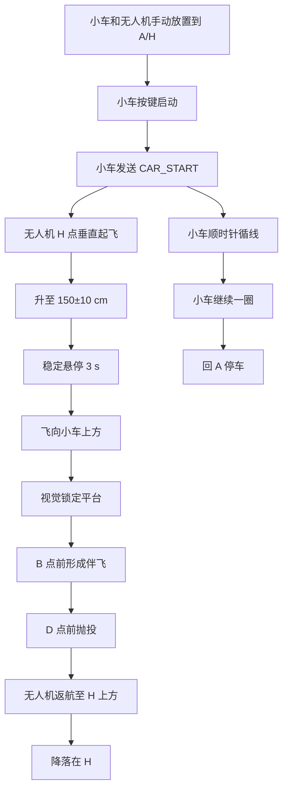

---
created: 2026-07-29
updated: 2026-07-29
status: 抛投任务设计
---

# 抛投任务状态机

## 1. 正式任务流程



## 2. 无人机状态机

```text
IDLE
  等待 CAR_START

TAKEOFF_TO_1P5M
  垂直起飞到 1.5 m

HOVER_3S
  悬停 3 秒

FLY_TO_CAR_PRELOCK
  按预估场地坐标飞到小车 A-B 段上方

VISUAL_LOCK
  下视相机寻找平台中心图案

FOLLOW_CAR
  视觉伺服跟随小车

DROP_PAYLOAD
  满足抛投条件后释放软质物体

RETURN_HOME
  回 H 点上方

LAND_HOME
  降落

DONE
  任务完成
```

## 3. 伴飞进入条件

建议满足以下条件才把状态置为 `FOLLOW_CAR`：

- [ ] `target_visible == true` 连续 0.5 秒以上；
- [ ] `confidence > 0.6`；
- [ ] 平台中心误差小于图像宽高的 20%；
- [ ] 高度在 1.4-1.6 m；
- [ ] 无人机水平速度没有异常突变。

## 4. 抛投触发条件

建议满足以下条件再抛：

- [ ] 已进入 `FOLLOW_CAR`；
- [ ] 当前时间未超过任务限制；
- [ ] 小车尚未到 D 点，或估计进度 `< D点进度`；
- [ ] `target_visible == true` 连续 N 帧；
- [ ] `abs(cx_error_px) < threshold_x`；
- [ ] `abs(cy_error_px) < threshold_y`；
- [ ] 视觉置信度稳定；
- [ ] 抛投机构已上锁且只触发一次。

## 5. 抛投提前量

如果小车在图像中向前运动，无人机释放物体后，物体下落需要时间。保守估计：

```text
h = 1.5 m
自由落体时间 t ≈ sqrt(2h/g) ≈ 0.55 s
```

如果小车速度是 `v_car`，抛投点需要提前：

```text
lead = v_car * 0.55 s
```

例子：

| 小车速度 | 理论提前量 |
|---:|---:|
| 0.2 m/s | 11 cm |
| 0.3 m/s | 17 cm |
| 0.4 m/s | 22 cm |

实际还要考虑：

- 抛投机构释放延迟；
- 无人机水平速度；
- 物体空气阻力；
- 物体弹跳/滚动。

所以必须用实测修正，不要只靠公式。

## 6. 软质物体建议

目标：落到平台后不弹出黑圈。

推荐：

- 软布袋；
- 橡皮泥/软胶底；
- 质量 25 g 左右；
- 扁平化，降低弹跳；
- 表面不要太滑。

不推荐：

- 弹力球；
- 硬塑料块；
- 容易滚动的圆柱/球体；
- 太轻导致飘的物体。

## 7. 调试顺序

1. 静止平台，手动释放，找物体结构；
2. 静止平台，无人机悬停释放；
3. 小车低速直线运动释放；
4. 小车沿轨迹低速运动释放；
5. 完整流程 D 点前释放；
6. 提高速度到 90 秒内完成。